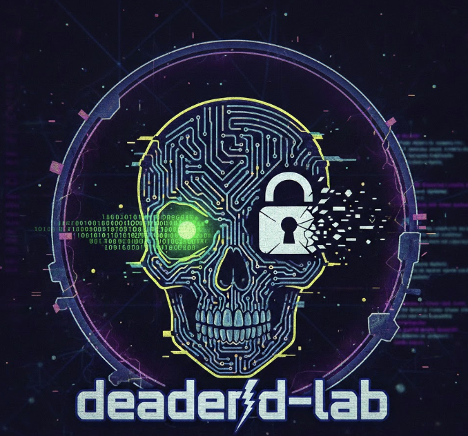

<!-- deadend-lab:logo -->
<p align="center">
  
</p>
<!-- /deadend-lab:logo -->

# Dead-End Encryption (DEE) Lab

**RESEARCH / CTF ONLY - DO NOT USE IN PRODUCTION**

Research and challenge harness for DEE + StegoPQ handshake. This is not production crypto.

## Quick Start

```bash
./scripts/bootstrap.sh
```

Requires: Go 1.22+, Docker (optional). Bootstrap runs fmt, lint, test, build, corpus-gen, docker build, and docker compose up.

## Manual Commands

```bash
make fmt lint test test-race fuzz build
make corpus
make vectors
make docker-build docker-run
make attack-nonce-reuse
make attack-replay
```

## Demo CLI

```bash
./bin/dee-demo -mode SAFE -msg "hello"
./bin/dee-demo -mode NAIVE -msg "test"
```

## Lab Server Endpoints

- `POST /scenario/safe` - Run SAFE mode handshake + encrypt/decrypt roundtrip.
- `POST /scenario/naive` - Same for NAIVE mode.
- `GET /health` - Health check.

Response schema: `{ok, mode, version, carrier, reason_code, handshake_ms, encrypt_ms, decrypt_ms, ciphertext_len, replay_rejected, session_id_trunc}`

```bash
curl -X POST http://localhost:${DEE_PORT:-8080}/scenario/safe
curl -X POST http://localhost:${DEE_PORT:-8080}/scenario/naive
curl http://localhost:${DEE_PORT:-8080}/health
```

If port 8080 is busy, override: `DEE_PORT=9188 docker compose up -d`

## How to Break NAIVE

1. **Nonce reuse** (plaintext recovery): `make attack-nonce-reuse` - EncryptNaiveWithNonce allows caller-supplied nonce. Same nonce twice yields ct1 XOR ct2 = p1 XOR p2; known p1 recovers p2.
2. **Replay**: `make attack-replay` - NAIVE does not enforce counter monotonicity; same ciphertext decrypts multiple times.

## Why SAFE Resists

- **TestNonceUniquenessSAFE**: Every (counter, AD) yields unique nonce; no caller-supplied nonce.
- **TestCounterMonotonicityRejectReplay**: Strict counter; replay returns ErrDecrypt.
- **TestCounterMonotonicityRejectOutOfOrder**: Counter must equal next expected; out-of-order rejected.
- **TestSAFERejectsCallerNonce**: EncryptNaiveWithNonce returns ErrDecrypt in SAFE.
- **TestUniformFailure**: Tamper, wrong key, wrong AD all return identical ErrDecrypt (no oracle).

## Specs

- spec/dee.md - Protocol, key schedule, modes
- spec/stegopq.md - Carrier encoding
- spec/threat-model.md - Attacker model
- spec/security-goals.md - Test mapping

## Challenge

- challenge/break-me.md - Rules and win conditions
- challenge/scoreboard.md - Scoring rubric
- challenge/datasets/ - Generated corpuses

## Releases

See [CHANGELOG.md](CHANGELOG.md).

### Local release-candidate run (stop-the-line gate)

From a clean working tree:

```bash
./scripts/pre-push-gate.sh
```

Or manually (paste-and-run from repo root):

```bash
set -euo pipefail
test -z "$(git status --porcelain)" || { echo "Working tree not clean"; exit 1; }
make rc
make vectors && git diff --exit-code
make secret-scan
go test ./tests/policy/... -count=1
make verify-clean
docker build -t deadend-lab .
DEE_PORT=9188 docker compose up -d
curl -fsS http://localhost:9188/health >/dev/null
curl -fsS -X POST http://localhost:9188/scenario/safe >/dev/null
curl -fsS -X POST http://localhost:9188/scenario/naive >/dev/null
go run ./cmd/attacks/nonce-reuse
go run ./cmd/attacks/replay
```

Or step-by-step:

```bash
make verify-clean
docker build -t deadend-lab .
DEE_PORT=9188 docker compose up -d
curl http://localhost:9188/health
curl -X POST http://localhost:9188/scenario/safe
curl -X POST http://localhost:9188/scenario/naive
go run ./cmd/attacks/nonce-reuse
go run ./cmd/attacks/replay
```

### Tag and push

```bash
git tag -a v0.1.0 -m "deadend-lab research preview v0.1.0"
git push origin main --tags
```

### GitHub release notes

Include:

- **How to run Docker**: `docker build -t deadend-lab .` then `DEE_PORT=9188 docker compose up -d` (override port if 8080 is busy)
- **How to break NAIVE**: `make attack-nonce-reuse` (nonce reuse), `make attack-replay` (replay)
- **Why SAFE resists**: Invariant tests (nonce uniqueness, counter monotonicity, uniform failure); policy tests (deterministic DRBG/handshake vector-only); see README "Why SAFE Resists"

### Post-release feedback

Contributions welcome: break NAIVE via demos, add attacks as `cmd/attacks/*`, add invariants/policy tests (do not weaken existing ones). File issues with repro steps and `make release-check` output.

## Author / Maintainer

- **Thor Thor**
- GitHub: [@codethor0](https://github.com/codethor0)
- Email: codethor@gmail.com

See [CONTRIBUTING.md](CONTRIBUTING.md) for contribution rules. Changes require `make verify` to pass.

